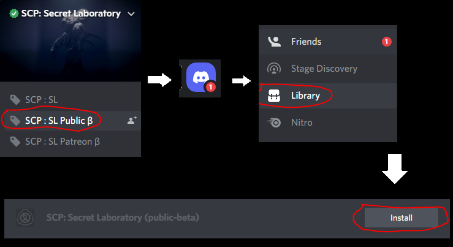

# **User FAQ | Public Beta**

## How to play the beta

### Steam

Open Steam and navigate to "Library" at the top left and click home, Then find "SCP: Secret Laboratory" and right-click the game and open "Properties..." then click "Betas" and choose "publicbeta - 11.0.0".

- If you want to switch back to stable version choose "none" in Betas

### Discord

You must be in the official SCP:SL Discord server, Go to the top of the server and select "SCP : SL Public B" and add it to your Discord library, After it is added we suggest that you restart Discord since Discord acts up when you add a game to your library, After restarting navigate to your Home page and click "Library" near the top left and click "Install" next to "SCP: Secrect Laboratory (public-beta). Images are below if you are having an issue.

***

## Known Issues/Bugs

### These are issues/bugs that are known/confirmed

1. Black void doors | Some doors will be completely blacked out.
2. ~~Some SCP encounters can destroy your ears with awful & really loud sounds.~~
3. ~~SCP-079 sometimes will not get auto-RC'ed when all other SCP's are RC'ed.~~
4. Visual bug with surroundings going invisible.
5. ~~Boxes that hold guns going invisible.~~
6. ~~Sinkhole visual glitch.~~
7. Can't interact/do anything. (Really annoying)
8. Some hardcore FPS drops.
9. ~~Smoke visual bug not showing in nuke room.~~
10. Random crashing.
11. Sometimes your screen can turn into Discord white theme.
12. ~~False ending screens.~~
13. ~~SCP-173 can sometimes move when being looked at.~~
14. Massive desync.
15. Item dupe.
16. Playerlist not showing everyone.

## Unknown Issues/Bugs

### These are issues/bugs that are unknown/not confirmed
1. Visual bug with SCP-079's screen getting 5 pixels.
2. A invisible HCZ Armory inside of HCZ.
3. This one seems to be really rare, If you enter a elevator and use it you will get teleported somewhere in a void.

### If there is any bugs we are missing & you think should be added please let us know on our Discord server! Also if a issue gets crossed out that means it was fixed.