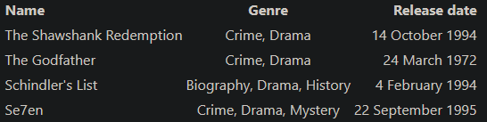

! Details on the full capabilities of Spectre.css can be found in the [Official Spectre Documentation](https://picturepan2.github.io/spectre/elements.html)

Last update: 10/21/2021

***
### **Headings**

# H1 Heading `40px`

## H2 Heading `32px`

### H3 Heading `28px`

#### H4 Heading `24px`

##### H5 Heading `20px`

###### H6 Heading `16px`

```html
<h1>h1 Heading</h1>
<h2>h2 Heading</h2>
<h3>h3 Heading</h3>
<h4>h4 Heading</h4>
<h5>h5 Heading</h5>
<h6>h6 Heading</h6>
```

***
## **Code**

### **Inline code**

Wrap inline snippets of code with <code>`</code>.

```
In this example, `<section></section>` should be wrapped as **code**.
```
Renders to:

In this example, `<section></section>` should be wrapped with code.

HTML:
```html
<p>In this example, <code>&lt;section&gt;&lt;/section&gt;</code> should be wrapped with <strong>code</strong>.</p>
```

### **Syntax highlighting**

GFM, or "GitHub Flavored Markdown" also supports syntax highlighting. To activate it, simply add the file extension of the language you want to use directly after the first code "fence", <code>```js</code>, and syntax highlighting will automatically be applied in the rendered HTML. For example, to apply syntax highlighting to JavaScript code:

<pre>
```js
grunt.initConfig({
  assemble: {
    options: {
      assets: 'docs/assets',
      data: 'src/data/*.{json,yml}',
      helpers: 'src/custom-helpers.js',
      partials: ['src/partials/**/*.{hbs,md}']
    },
    pages: {
      options: {
        layout: 'default.hbs'
      },
      files: {
        './': ['src/templates/pages/index.hbs']
      }
    }
  }
};
```
</pre>

Renders to:

```js
grunt.initConfig({
  assemble: {
    options: {
      assets: 'docs/assets',
      data: 'src/data/*.{json,yml}',
      helpers: 'src/custom-helpers.js',
      partials: ['src/partials/**/*.{hbs,md}']
    },
    pages: {
      options: {
        layout: 'default.hbs'
      },
      files: {
        './': ['src/templates/pages/index.hbs']
      }
    }
  }
};
```

***
### **Comments**

Comments should be HTML compatible

```
<!--
This is a comment
-->
```

Comment below should NOT be seen:

***
### **Horizontal Rules**
The HTML `<hr>` element is for creating a "thematic break" between paragraph-level elements. In markdown, you can create a `<hr>` with any of the following

* <code>___</code>: three consecutive underscores
* <code>---</code>: three consecutive dashes
* <code>***</code>: three consecutive asterisks

renders to:
___
---
***
<br />
<br />

***
### **Inline HTML**

If you need a certain HTML tag (with a class) you can simply use HTML:

Paragraph in Markdown.

```
<div class="class">
    This is <b>HTML</b>
</div>
```
Paragraph in Markdown.

***
### **Paragraphs**

Paragraphs are really simple, You're seeing one right now, Just straight raw text with no markdown.


***
### **Markdown Semantic Text Elements**

**Bold** `**Bold**`

_Italic_ `_Italic_`

~~Deleted~~ `~~Deleted~~`

***
### **HTML Semantic Text Elements**

<abbr>I18N</abbr> `<abbr>`

<cite>Citation</cite> `<cite>`

<kbd>Ctrl + S</kbd> `<kbd>`

Text<sup>Superscripted</sup> `<sup>`

Text<sub>Subscripted</sub> `<sub>`

<u>Underlined</u> `<u>`

<mark>Highlighted</mark> `<mark>`

<time>20:14</time> `<time>`

<var>x = y + 2</var> `<var>`


***
### **Blockquote**

> The advance of technology is based on making it fit in so that you don't really even notice it,
> so it's part of everyday life.
>
> <cite>- Bill Gates</cite>

```markdown
> The advance of technology is based on making it fit in so that you don't really even notice it,
> so it's part of everyday life.
>
> <cite>- Bill Gates</cite>
```

***
### **Unordered List**

* list item 1
* list item 2
    * list item 2.1
    * list item 2.2
    * list item 2.3
* list item 3

```markdown
* list item 1
* list item 2
    * list item 2.1
    * list item 2.2
    * list item 2.3
* list item 3
```

***
### **Ordered List**

1. list item 1
1. list item 2
    1. list item 2.1
    1. list item 2.2
    1. list item 2.3
1. list item 3

```markdown
1. list item 1
1. list item 2
    1. list item 2.1
    1. list item 2.2
    1. list item 2.3
1. list item 3
```

***
### **Table**
Tables don't have a preset style for then , So you can just override `table, th, td` in a style for the page to make your own, Below is a image as to what a table would look like default, Below that is what using the custom CSS with make a table look like

#### Default table



#### 	Cooler table

| Name                        | Genre                         | Release date         |
| :-------------------------- | :---------------------------: | -------------------: |
| The Shawshank Redemption    | Crime, Drama                  | 14 October 1994      |
| The Godfather               | Crime, Drama                  | 24 March 1972        |
| Schindler's List            | Biography, Drama, History     | 4 February 1994      |
| Se7en                       | Crime, Drama, Mystery         | 22 September 1995    |

```markdown
| Name                        | Genre                         | Release date         |
| :-------------------------- | :---------------------------: | -------------------: |
| The Shawshank Redemption    | Crime, Drama                  | 14 October 1994      |
| The Godfather               | Crime, Drama                  | 24 March 1972        |
| Schindler's List            | Biography, Drama, History     | 4 February 1994      |
| Se7en                       | Crime, Drama, Mystery         | 22 September 1995    |
```
```css
    table{
        border-collapse: collapse;
        border-spacing: 0;
        border: 2px;
}
    th {
        color: #D5DDE5;
        background: #1b1e24;
        border-bottom-color: rgb(80,80,80);
        border-bottom-style: solid;
        border-bottom-width:3px;
        border-left-color: rgb(80,80,80);
        border-left-style: solid;
        border-left-width:2px;
        border-right-color: rgb(80,80,80);
        border-right-style: solid;
        border-right-width: 2px;
        border-top-color: rgb(80,80,80);
        border-top-style: solid;
        border-top-width: 2px;
        font-size: 18px;
        font-weight: 100;
        padding: 14px;
        text-align: left;
        text-shadow: 0 1px 1px rgba(0, 0, 0, 0.1);
        vertical-align: middle;
}

    td {
        border-style : solid;
        border: 1px solid rgb(80,80,80);
        background: #242627;
        padding: 20px;
        text-align: left;
        vertical-align: middle;
        font-weight: 300;
        font-size: 18px;
        text-shadow: -1px -1px 1px rgba(0, 0, 0, 0.1);
}
```

***
### **Notices**

The notices styles are actually provided by the `markdown-notices` plugin but are useful enough to include here:

! This is a warning notification

!! This is a error notification

!!! This is a default notification

!!!! This is a success notification

```markdown
! This is a warning notification

!! This is a error notification

!!! This is a default notification

!!!! This is a success notification
```

***
### **Colored Text**

```markdown
This is <span style="color:red">red text</span> and this is <span style="color:#000099">blue text</span>.
```
This is <span style="color:red">red text</span> and this is <span style="color:#000099">blue text</span>.
 
 ***
 ### **Icons**
 
## <i class="fas fa-book"></i> <i class="fas fa-wrench"></i>

```html
<i class="fas fa-book"></i> <i class="fas fa-wrench"></i>
```
We got a integration for FontAwesome so its really easy to use icons, You can see all there icons [here](https://fontawesome.com/v5.15/icons?d=gallery&p=2).
 
 
 ***
 ### **Named Anchors**
 
 Named anchors enable you to jump to the specified anchor point on the same page. For example, each of these chapters:
 
 ```md
 # Table of Contents
  * [Chapter 1](#chapter-1)
  * [Chapter 2](#chapter-2)
  * [Chapter 3](#chapter-3)
  ```
  will jump to these sections:
  
  
```md
## Chapter 1 <a id="chapter-1"></a>
Content for chapter one.

## Chapter 2 <a id="chapter-2"></a>
Content for chapter one.

## Chapter 3 <a id="chapter-3"></a>
Content for chapter one.
```

NOTE that specific placement of the anchor tag seems to be arbitrary. They are placed inline here since it seems to be unobtrusive, and it works.
 
 
 <style>
    table{
        border-collapse: collapse;
        border-spacing: 0;
        border: 2px;
}
    th {
        color: #D5DDE5;
        background: #1b1e24;
        border-bottom-color: rgb(80,80,80);
        border-bottom-style: solid;
        border-bottom-width:3px;
        border-left-color: rgb(80,80,80);
        border-left-style: solid;
        border-left-width:2px;
        border-right-color: rgb(80,80,80);
        border-right-style: solid;
        border-right-width: 2px;
        border-top-color: rgb(80,80,80);
        border-top-style: solid;
        border-top-width: 2px;
        font-size: 18px;
        font-weight: 100;
        padding: 14px;
        text-align: left;
        text-shadow: 0 1px 1px rgba(0, 0, 0, 0.1);
        vertical-align: middle;
}

    td {
        border-style : solid;
        border: 1px solid rgb(80,80,80);
        background: #242627;
        padding: 20px;
        text-align: left;
        vertical-align: middle;
        font-weight: 300;
        font-size: 18px;
        text-shadow: -1px -1px 1px rgba(0, 0, 0, 0.1);
}
    </style>